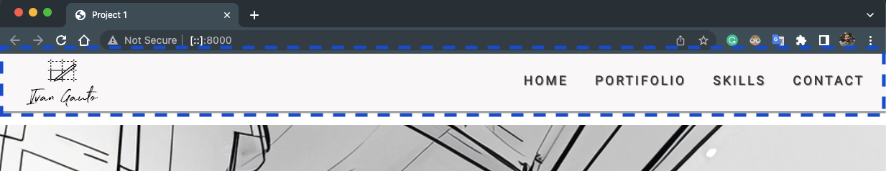

# CI Project 1

## Ivan Gauto's Portifolio
 
This webpage was built to showcase the work of the architect **Ivan Gauto**. It's an inviting simple and bright webpage designed to accommodate the architect's requirements for a minimalist visual, with easy navigation and focusing on the important content, his work. The portifolio section will cluminate by presenting some of Ivan's projects. The webpage also allows visitors to contact Ivan for quotations or to share interests in common.

The webpage was built with responsiveness for the most common screen sizes so visitors with various devices can safely and easily navigate and enjoy the content.

Welcome to Ivan's Portifolio webpage, enjoy your time navigating and take a moment to reach out to this brilliant architect.

## Features

### Header
The header is comprised of logo and nav bar with menu options for navigation. It's set to sticky to the top of the page while the visitor scrolls down and up, allowing for easy access to the available menu items. The color is slightly darker than the white backbround of the webpage to differentiate the sections clearly.

### The logo
The logo was created with [Looka](https://looka.com/) and adjusted in [Adobe Photoshop Beta](https://www.adobe.com/ie/products/photoshop.html), it's cutomized to **Ivan Gauto**, the architect whose the page is all about!

### Nav menu
Easy navigation is very important to keep visitors engaged. The nav menu contains links to the various sections of the webpage and it's positioned on the top of the page within the header which also follows the visitor while scrolling down or up to make it easier to access other sections of the webpage.

### Hero image and cover text
As the face of the webpage, the hero image was created using [Adobe Firefly](https://www.adobe.com/sensei/generative-ai/firefly.html). It reflects the day to day activities of an architect working with forms and light. The cover text is a citation from the famous architect [Le Corbusier](https://en.wikipedia.org/wiki/Le_Corbusier). The combination of both elements help the visitor to seamlessly grasp what the page is about.

### Information section
This section was developed with the intent to welcome visitors to contact the architect for any of the listed services, but also emphasizing that whatever design dream the visitor may have, it's achievable. This section may be complemented as necessary to contain even more services if desired.

### Portifolio section
In this section the visitor can visualize the architect's portifolio. It's a very important section and future developments should allow for clicking on the project thumbnail to redirect the visitor to a full screen view of the images and detailed description of the architect's work.

### Skills section
The skills section enables the architect to show the most important technologies/tools with which he has experience. Each icon is a clickable link that will redirect the visitor to the specific tool webpage where the visitor can find more information about the tool.

### Contact section
Among the options for contacting the architect, the nav menu contains a link 'CONTACT' which will redirect the visitor to a contact form in a different page "contact.html". Allowing means for contacting is very important for the webpage as the architect is showcasing his work, and visitors may want to get in touch for a quotation or to discuss interests in common.

Because contact options are a must for the webpage, icons in the footer section are also clickable and will redirect the visitor to the architect's social networks, allow for sending email or a phone call. The footer section will be commented below.

### Footer
This is the last section of the webpage and it's located at the bottom. It contains icons with the architect's social networks and means for contact along with the copyright statement which is standard for webpages. The icons are clickable and will redirect the visitor to the specific social network or mean of contact.

## Sources
- Webpage template provided by Code Institute: [CI full template](https://github.com/Code-Institute-Org/ci-full-template)
- Footer icons provided by [Font Awesome](https://fontawesome.com/)

## Bugs and resolution

### Pushing code to Github

When pushing commits to Git from Visual Studio Code, the following error may be perceived:

    `Enumerating objects: 75, done.
    Counting objects: 100% (75/75), done.
    Delta compression using up to 16 threads
    Compressing objects: 100% (51/51), done.
    error: RPC failed; HTTP 500 curl 22 The requested URL returned error: 500
    send-pack: unexpected disconnect while reading sideband packet
    Writing objects: 100% (69/69), 160.13 MiB | 5.99 MiB/s, done.
    Total 69 (delta 22), reused 0 (delta 0), pack-reused 0
    fatal: the remote end hung up unexpectedly
    Everything up-to-date`

The resolution was to set "git config http.postBuffer 524288000" as per post in Stack Overflow: [Git fails when pushing commit to github](https://stackoverflow.com/questions/2702731/git-fails-when-pushing-commit-to-github)

### Errors in the code found upon validation

#### Errors found in the index.html file:

1. Error:

`Bad value https://www.autodesk.eu/products/3ds-max/overview?mktvar002=4417848|SEM|18880029258|142956061346|kwd-10085200&term=1-YEAR&tab=subscription&plc=3DSMAX#overview_panel_thumbnail for attribute href on element a: Illegal character in query: | is not allowed.
From line 138, column 17; to line 139, column 72
<a href="https://www.autodesk.eu/products/3ds-max/overview?mktvar002=4417848|SEM|18880029258|142956061346|kwd-10085200&term=1-YEAR&tab=subscription&plc=3DSMAX#overview_panel_thumbnail" target="_blank" rel="noopeneer" aria-label="3DSmax">`

This error cannot be resolved as Autodesk webpage uses the pipes to identify the subpage of the product.

#### Errors found in the contact.html file:

1. Error:

`Bad value text-area for attribute type on element input.
From line 41, column 17; to line 41, column 96
<input type="text-area" id="message" name="message" class="text-input" required>`

Resolved by correcting the type attribute to "text".

2. Error:

`Attribute required is only allowed when the input type is checkbox, date, datetime-local, email, file, month, number, password, radio, search, tel, text, time, url, or week.
From line 41, column 17; to line 41, column 96
<input type="text-area" id="message" name="message" class="text-input" required>`

Resolved in error 1 when the type was changed to "text".

## Testing

### User tests

The index.html and contact.html pages were tested in the following browsers:
- Google Chrome - Version 115.0.5790.98 (Official Build) (x86_64)
- Moziela Firefox - 115.0.2 (64-bit)
- Safari - Version 16.5.2 (18615.2.9.11.10)

The tests conducted analysed the behaviour of all components specially header menu and footer in different sizes, either by using Chrome Dev tools or by resizing the browser window manually.

In all sizes tested, menus, icons and content are visible and readable confirming the webpage responsiveness.

### Code Validation

Validation of the HTML code of both pages (index.html and contact.html) was done by using [W3C Markup Validation Service](https://validator.w3.org/) and the code was fully validated with an exception, one link (href) contained in the Skills section, for the icon 3DSmax, did not pass validation for containing | (pipes), however, Autodesk webpage uses these pipes to identify the product code and redirect the visitor to the specific subpage.

The style.css file was validated by [W3C CSS Validation Service](https://jigsaw.w3.org/css-validator/) and there were no errors found.

## Deployment

## References
- This webpage was built with asistance of Code Institute professors and mentor as deliverable for "Project 1" of the course "Diploma in Full Stack Software Development (E-commerce Applications)". I extend here my gratitude for such support and material provided.

- [How to reverse order of elements while using float:right for the menu items](https://stackoverflow.com/questions/4224476/floatright-reverses-order-of-spans)

- [Reference for aligning elemets on the top of a container](https://www.w3docs.com/snippets/css/how-to-align-inline-block-elements-to-top-of-the-container.html)

- [How to create a fixed header or footer using CSS](https://www.tutorialrepublic.com/faq/how-to-create-fixed-header-or-footer-using-css.php)

- [Control opacity of a background image without impacting other elements](https://coder-coder.com/background-image-opacity/)

- [Markdown guide to help builing this README.md file provided by Matt Cone on Github](https://github.com/mattcone/markdown-guide)

## Credits

- To Code Institute for providing the material in the LMS portal, specially the module "Love Runing" that shows students how to put in practice the theory learned.
- Logo created using [Looka](https://looka.com/) and adjusted in [Adobe Photoshop Beta](https://www.adobe.com/ie/products/photoshop.html) by myself.
- Hero image created using [Adobe Firefly](https://www.adobe.com/sensei/generative-ai/firefly.html) and adjusted in [Adobe Photoshop Beta](https://www.adobe.com/ie/products/photoshop.html) by myself.
- Pictures in the Portifolio section and icons in the Skills section were provided by **Ivan Gauto** that kindly allowed me to create this project with his requirements for a professional architect webpage to showcase his portifolio.